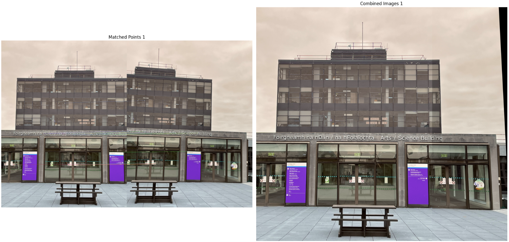

# Panorama Image Stitching

## Overview
This project implements a panorama image stitching algorithm that combines multiple images into a single seamless panoramic view. The technique involves keypoint detection, feature matching, and geometric transformations to align and merge images.

## Features
- **Image Alignment**: Uses ORB (Oriented FAST and Rotated BRIEF) for keypoint detection and description.
- **Feature Matching**: Employs a brute-force matcher to identify corresponding points between images.
- **Panorama Creation**: Combines multiple images into a panorama while handling perspective distortions.

## Example Image

